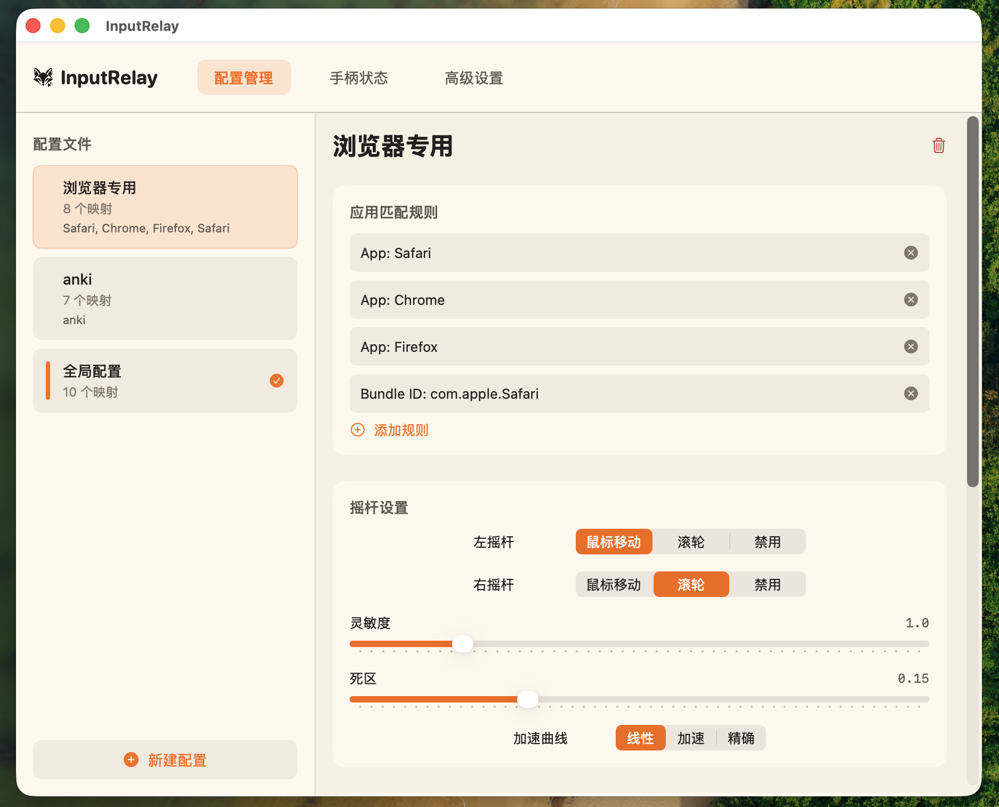
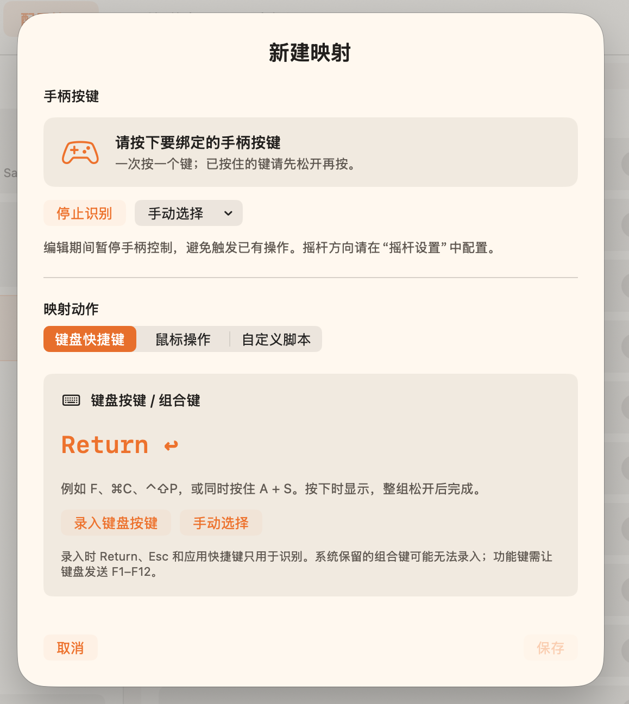

<div align="center">


# InputRelay

**用游戏手柄控制你的 Mac。**

移动鼠标、滚动页面、触发快捷键，为不同应用设置自己的按键布局。


[](LICENSE)

[快速开始](#快速开始) · [使用说明](#使用说明) · [常见问题](#常见问题) · [反馈问题](https://github.com/welann/InputRelay/issues)

</div>

## 功能

- **摇杆控制鼠标与滚动**：左右摇杆可分别设置为鼠标移动、滚轮或禁用，支持灵敏度、死区和加速曲线调整，以及多显示器鼠标移动。
- **按键映射**：将手柄按键绑定到键盘按键、组合键、鼠标操作或自定义 Shell 脚本。
- **直接按键录入**：按下手柄按键即可选中，再录入键盘快捷键；也可手动选择。编辑期间暂停手柄控制，重复绑定时可确认替换。
- **按应用切换配置**：通过应用名称或 Bundle ID 匹配前台应用，切换对应配置。
- **实时手柄状态**：查看连接情况、按键、扳机和摇杆反馈，按 Xbox 布局统一显示。
- **原生 macOS 应用**：SwiftUI 浅色界面，提供菜单栏快捷入口，可随时切换配置或暂停映射，无第三方依赖。

## 应用截图

### 配置管理

为不同应用管理配置，设置匹配规则并调整摇杆行为。



### 按键映射

直接按下要绑定的手柄按键，再选择键盘快捷键、鼠标操作或自定义脚本。

<p align="center">
  
</p>

## 快速开始

### 系统要求

- macOS 14.0 或更高版本。
- macOS GameController 框架可识别的扩展游戏手柄。
- 辅助功能权限，用于模拟键盘和鼠标输入。
- 从源码构建需要支持 Swift 6.0 的 Xcode Command Line Tools 或 Xcode。

### 从源码构建

```bash
git clone https://github.com/welann/InputRelay.git
cd InputRelay
./build.sh release
open .build/InputRelay.app
```

构建产物位于 `.build/InputRelay.app`，可复制到“应用程序”文件夹后使用。构建脚本默认使用本地临时签名，也可通过 `CODE_SIGN_IDENTITY` 指定签名身份。

若遇到 SDK 或 SwiftUI 宏插件相关构建错误，请参阅[开发文档](docs/DEVELOPMENT.md)。版本发布信息见 [Releases](https://github.com/welann/InputRelay/releases)。

### 首次使用

1. 打开 InputRelay，在 **系统设置 → 隐私与安全性 → 辅助功能** 中允许当前应用。
2. 通过蓝牙或 USB 连接手柄；多模式手柄请选择 **Xbox / XInput 模式**。
3. 在“手柄状态”中确认按键、扳机和摇杆能够被识别。
4. 打开“配置管理”，选择已有配置或点击“新建配置”，设置按键映射和摇杆行为。
5. 需要针对某个应用切换配置时，在该配置中添加应用匹配规则。

权限状态会自动刷新。关闭主窗口后应用仍在运行，可通过 Dock 或菜单栏重新打开。

## 使用说明

### 创建按键映射

1. 选择要编辑的配置，点击“添加映射”。
2. 按下要绑定的手柄按键，或使用“手动选择”。
3. 选择映射动作。对于键盘快捷键，点击“录入键盘按键”，按下目标按键或组合键，全部松开后完成录入。
4. 点击“保存”。如果该手柄按键已有绑定，可以确认替换或重新选键。

摇杆方向在“摇杆设置”中配置。系统保留的组合键可能无法录入。

### 默认配置

首次运行会创建“全局配置”和“浏览器专用”。下面是默认按键映射，可按习惯修改：

| 手柄按键 | 全局配置 | 浏览器专用 |
| --- | --- | --- |
| A | Return | Return |
| B | Esc | ⌘W，关闭标签页 |
| X | — | ⌘T，新建标签页 |
| Y | — | ⌘R，刷新 |
| LB / RB | ⌘[ / ⌘] | ⌘[ / ⌘]，后退 / 前进 |
| LT / RT | 鼠标左键 / 右键 | 鼠标左键 / 右键 |
| 方向键 | 键盘方向键 | — |

具体操作效果取决于当前应用对快捷键的支持。

### 摇杆与脚本

在“摇杆设置”中选择鼠标移动或滚轮模式，并调整灵敏度、死区和线性 / 加速 / 精确曲线。如果鼠标在松开摇杆后仍移动，可适当增大死区。

“自定义脚本”可执行 Shell 命令，也可通过 `osascript` 调用 AppleScript。例如：

```bash
# 截图到剪贴板
screencapture -c

# 设置系统音量
osascript -e 'set volume output volume 50'
```

### 菜单栏控制

点击菜单栏中的狐狸图标，可以查看当前配置和连接状态、快速切换配置、暂停或恢复映射，以及打开主窗口或退出应用。

## 常见问题

### 支持哪些手柄？

目前仅使用**冰原狼 4** 进行过实际测试。理论上，所有能被 macOS GameController 识别为扩展游戏手柄的 Xbox 控制器都可使用，但其他型号尚未逐一验证。

应用按 Xbox 按键位置统一显示名称；冰原狼等多模式设备建议使用 Xbox / XInput 模式。仅提供原始 HID 输入的设备不保证支持，Xbox 系统键也可能被 macOS 保留。

### 已经授予辅助功能权限，为什么仍提示未授权？

本地临时签名的应用在重新构建或更换路径后，可能需要重新授权。在“高级设置”点击“定位当前应用”，从系统辅助功能列表移除旧条目，再添加当前 `.app`，然后重启应用。

### 会影响正常使用键盘鼠标或玩游戏吗？

InputRelay 不会禁用原有键盘和鼠标。玩游戏时建议从菜单栏暂停映射，避免手柄操作同时触发桌面快捷键。

### 关闭窗口后如何彻底退出？

关闭窗口不会退出应用。点击顶部菜单栏图标，选择“退出”。

## 开发与贡献

项目使用 Swift 6、SwiftUI、GameController、CoreGraphics 和 AppKit，键码定义来自 Carbon。全部使用 macOS 原生框架，无第三方依赖。

- [用户指南](docs/USER_GUIDE.md)：详细操作说明。
- [开发文档](docs/DEVELOPMENT.md)：构建、测试与开发环境。
- [架构设计](docs/ARCHITECTURE.md)：模块划分与输入处理流程。
- [贡献指南](CONTRIBUTING.md)：参与开发的约定。

欢迎通过 [Issues](https://github.com/welann/InputRelay/issues) 报告问题或提出建议，也欢迎提交 Pull Request。报告问题时请附上 macOS 版本、应用版本或提交号、手柄型号及连接模式，以及复现步骤。

## 许可证

[MIT](LICENSE) · [welann](https://github.com/welann)
